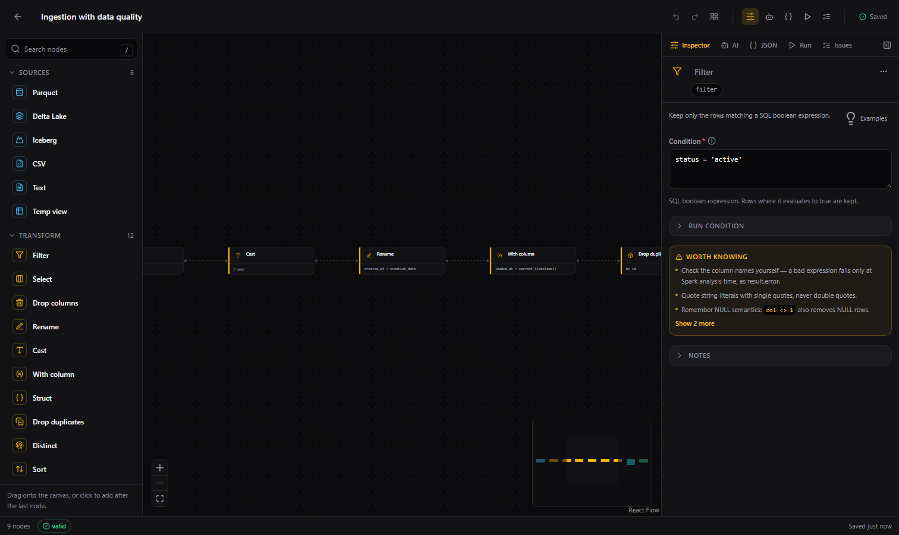
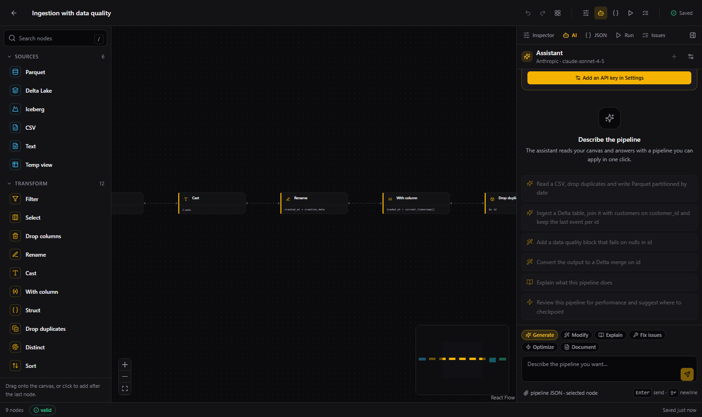
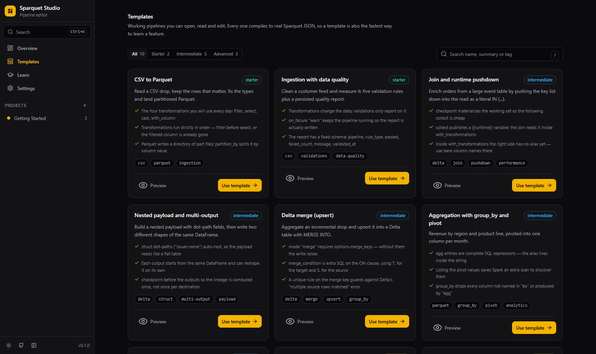

<div align="center">

# Sparquet Studio

**The visual editor for data pipelines that are just JSON.**

Design a Spark job on a canvas, let an AI draft it for you, and run it on your machine — the file it produces is plain [Sparquet](../README.md) JSON your cluster already understands.

[Quickstart](#quickstart) · [Why](#why-this-exists) · [Features](#features) · [Vocabulary](#workflows-jobs-and-pipelines) · [Your first job](#your-first-job) · [AI assistant](#ai-assistant) · [Local runner](#local-runner) · [Pipelines](#pipelines) · [Architecture](#architecture) · [Contributing](#contributing)



</div>

---

## Why this exists

Sparquet turns a data pipeline into a JSON document: an `input`, a list of `transformations`, a `validations` block and one or more `outputs`. That is a great runtime format — versionable, diffable, parameterizable — and an awkward authoring format. A 300-line config with nested joins is hard to read, easy to typo, and impossible to explain in a review.

Studio is the other half: **a canvas for the same document.** Nodes are the entries of the JSON, edges are the order they run in, and every edit compiles straight back to the file. Nothing is hidden, nothing is generated twice — what you see is what Spark executes.

If you know n8n, you already know the idea. This is that, for data engineering.

## Features

| | |
|---|---|
| **Visual job editor** | Drag sources, transformations, validations and destinations onto a canvas. Joins and unions take a second input, so a branching Job reads like a diagram instead of nested JSON. |
| **Data quality on the canvas** | Every validation rule is a box, and so are the three datasets the `validations` block writes: the quality report and the two quarantine outputs hang off the last rule as *side* outputs, drawn beside a main chain that keeps every row. |
| **Every Sparquet feature, typed** | All 20 transformations, 7 IO formats and 6 validators, with per-field help, defaults and the gotchas that only live in the framework source (positional `union`, `merge_keys`, `{{runtime}}` pushdown, dot-path `struct`, …). |
| **AI that writes jobs** | Describe what you need and get a complete, valid Job back — or ask it to modify, explain, optimize or fix the one on screen. Bring your own key for Anthropic, OpenAI, Google or any OpenAI-compatible endpoint. |
| **Live linting** | 20+ rules run as you type: unreachable nodes, a `merge` write without `merge_keys`, a `{{var}}` no `collect` publishes, a `{param}` you never declared, `collect` before `checkpoint`, two sinks fighting over one path, a quarantine output with no row-level rule to fill it. |
| **Round-trip JSON** | Import an existing config, edit it visually, export it byte-for-byte usable. The compiler is covered by tests that round-trip the framework's own example configs. |
| **Run it locally** | An optional Python service executes the compiled JSON with the real `Sparquet` and streams back counters, validation results, a data preview and the framework's structured logs. |
| **Jobs in sequence** | A **Pipeline** chains several Jobs into one ordered run — drawn on a canvas, executed stage by stage on the same runner, with per-stage status, logs and a preview of the last stage. |
| **Templates and lessons** | Ten working Jobs, from "CSV to Parquet" to Delta merge and runtime pushdown, plus six lessons that teach the language through the canvas. |
| **Local-first** | Workflows, Jobs and Pipelines live in your browser (IndexedDB). No account, no server, no telemetry. Export the whole workspace as one JSON file whenever you want. |

## Quickstart

```bash
git clone https://github.com/<your-org>/sparquet.git
cd sparquet/sparquet-studio
npm install
npm run dev
```

Open <http://localhost:5273>. The first launch seeds a **Getting Started** Workflow with working Jobs — open one and start editing.

Requirements: Node 18.18+ (Node 22 recommended). No API key and no Python needed to design Jobs; both are optional add-ons.

### Build for production

```bash
npm run build
npm run preview
```

`dist/` is a static bundle — it deploys to GitHub Pages, S3, Netlify or any static host as-is (the app uses hash routing, so no server rewrites are required).

## Workflows, Jobs and Pipelines

Studio nests three things:

| Concept | What it is | Route |
|---|---|---|
| **Workflow** | The container. Usually one per domain: `Sales`, `Billing`, `CRM`. | `/workflows/:id` |
| **Job** | One pipeline JSON, drawn on the node canvas. | `/jobs/:id` |
| **Pipeline** | An ordered set of Jobs that run in sequence. | `/pipelines/:id` |

> **A Job is one pipeline JSON.** The framework keeps its own vocabulary: one JSON
> *is* a pipeline — the file the `Pipeline` class executes and reports as a
> `PipelineResult`. In Studio that file is a **Job**, and the name **Pipeline** is
> reserved for a sequence of several of them. A Pipeline with four stages is four
> framework `Pipeline` runs, in order, sharing one Spark session.

A Workflow's screen is one list: the Jobs it holds, together with the Pipelines built out of them. **New pipeline** turns a set of Jobs into an ordered run.

## Your first job

1. **Create a Workflow.** A Workflow groups related Jobs; one per domain keeps names short.
2. **Add a source.** Drag *CSV* out of the palette, then set its path in the inspector on the right.
3. **Add transformations.** Drop a `filter`, then a `select`. Connect them left to right — the order on the canvas is the order in the `transformations` array.
4. **Add a destination.** Drag *Parquet* to the canvas, connect the last transformation into it, choose the write mode.
5. **Read the JSON.** Press <kbd>Ctrl/⌘</kbd>+<kbd>J</kbd>. That is exactly the file Sparquet runs — copy it, download it, or commit it next to your job.
6. **Run it.** Press <kbd>Ctrl/⌘</kbd>+<kbd>Enter</kbd> and start the [local runner](#local-runner) when prompted.

Prefer to learn by reading? **Learn** in the sidebar has six lessons that follow the same path, each linked to a template you can open.

### Data quality on the canvas

Each validation rule is its own box, chained on the main line like a transformation.
A run of them compiles into the single `validations` block the framework executes,
and `on_failure` — what a broken rule does to the *run* — stays in **Job settings**,
next to the Spark configs.

The three things that block **writes** are boxes too. The last rule of the run
exposes three extra handles along its bottom edge:

| Handle | Compiles into | What lands in it |
|---|---|---|
| `report` | `validations.report` | One row per rule: `pipeline`, `rule_type`, `check_name`, `severity`, `passed`, `failed_count`, `metric_value`, `message`, `validated_at`. |
| `valid rows` | `validations.outputs.valid` | A copy of the rows that break no row-level rule. |
| `invalid rows` | `validations.outputs.invalid` | A copy of the rows those same rules rejected. |

Drag from a handle onto a destination node and it stops being an entry of
`outputs[]`: it compiles into the validation block instead, and the box says so
(*side output* chip, dashed link, its own inspector header).

> **Quarantine copies rows out — it does not divert them.** `Pipeline.run()` calls
> `_write_validation_outputs(df)` and then `_write_outputs(df)` with the **same,
> complete** DataFrame. The invalid rows are written to the quarantine *and* to
> every destination on the main chain. That is why the side outputs hang **below**
> the rule while the chain carries on to the right: nothing is taken off it. If the
> main destination must not carry the bad rows, remove them yourself with a `filter`.

Only row-level rules can sort a row into `valid` / `invalid`: `not_null`, `unique`,
`range`, `regex`, and the `check` metrics that count rows one by one
(`missing_*`, `invalid_*`). An aggregate rule (`row_count`, `schema`, `sql`, `avg`,
`freshness`, …) judges the whole DataFrame, so with only those on the chain every
row comes out valid — the linter warns when a quarantine box can never receive
anything meaningful.

`examples/06_quarentena_validacoes.json` is a complete config of this shape.

### Keyboard

| Shortcut | Action |
|---|---|
| <kbd>Ctrl/⌘</kbd>+<kbd>K</kbd> | Command palette |
| <kbd>Ctrl/⌘</kbd>+<kbd>S</kbd> | Save now (edits autosave anyway) |
| <kbd>Ctrl/⌘</kbd>+<kbd>Z</kbd> / <kbd>⇧</kbd>+<kbd>Ctrl/⌘</kbd>+<kbd>Z</kbd> | Undo / redo |
| <kbd>Ctrl/⌘</kbd>+<kbd>Enter</kbd> | Run panel |
| <kbd>Ctrl/⌘</kbd>+<kbd>J</kbd> | JSON panel |
| <kbd>Ctrl/⌘</kbd>+<kbd>/</kbd> | AI assistant |
| <kbd>Ctrl/⌘</kbd>+<kbd>E</kbd> | Issues |
| <kbd>⇧</kbd>+<kbd>Ctrl/⌘</kbd>+<kbd>L</kbd> | Auto-layout |
| <kbd>Ctrl/⌘</kbd>+<kbd>D</kbd> / <kbd>Del</kbd> | Duplicate / delete selection |

## AI assistant



The assistant knows the pipeline language because its system prompt is generated **from the same catalog that drives the forms** — it cannot drift from what the framework supports.

Ask it to:

- *"Read a CSV, drop duplicates on id and write Parquet partitioned by date"* — get a full Job.
- *"Add a data quality block that fails on nulls in id"* — get a modified version of what is on the canvas.
- *"Explain what this job does"* — get a plain-English walkthrough.
- *"Fix the issues"* — hand it the lint output and the current graph.

Every proposal arrives as a card you review before applying, and applying it is a single undo away.

### Setting it up

**Settings → AI assistant**, pick a provider and paste a key:

| Provider | Get a key | Default model |
|---|---|---|
| Anthropic | <https://console.anthropic.com/settings/keys> | `claude-sonnet-4-5` |
| OpenAI | <https://platform.openai.com/api-keys> | `gpt-4.1` |
| Google | <https://aistudio.google.com/apikey> | `gemini-2.5-pro` |
| OpenAI-compatible | your own gateway, Ollama, vLLM… | free text |

The key is used to call the provider **directly from your browser** and is never sent anywhere else — there is no Sparquet server in the loop. By default it is kept in memory for the session only; "Remember key in this browser" stores it in `localStorage`, which is convenient on a personal machine and a bad idea on a shared one.

## Local runner

Designing a Job needs nothing but the browser. **Executing** it needs Spark, so Studio ships a small FastAPI service you run yourself. This is the end-to-end tutorial to get the **Run** button working — for a single Job and for a whole [Pipeline](#pipelines).

### Prerequisites

| | |
|---|---|
| **Node 18.18+** | to serve Studio itself (`npm run dev`) |
| **Python 3.9+** | to run the local runner |
| **A JDK Spark supports** | JDK **17** for Spark 3.5, 17+ for Spark 4 — **not** Java 8. Set `JAVA_HOME` to it. |
| **Windows only:** Hadoop shims | `winutils.exe` + `hadoop.dll` and `HADOOP_HOME`, or Spark hangs the first time it touches the filesystem — see [step 4](#4-windows-only-give-spark-its-hadoop-shims) |

### 1. Start Studio

```bash
cd sparquet-studio
npm install
npm run dev            # http://localhost:5273
```

### 2. Set up the runner in a virtual environment

From the `sparquet-studio/` directory, create and activate a venv, then install the runner's dependencies plus the framework (which brings `pyspark` and `sparquet-cola`):

**Windows (PowerShell)**

```powershell
cd sparquet-studio
python -m venv .venv
.\.venv\Scripts\Activate.ps1
pip install -r server/requirements.txt
pip install sparquet                 # brings pyspark + sparquet-cola
```

> If PowerShell blocks the activation script, allow it for the current user once:
> `Set-ExecutionPolicy -Scope CurrentUser RemoteSigned`.

**macOS / Linux / WSL2**

```bash
cd sparquet-studio
python3 -m venv .venv
source .venv/bin/activate
pip install -r server/requirements.txt
pip install sparquet                 # brings pyspark + sparquet-cola
```

> Prefer the in-repo framework instead of the published package? Swap `pip install sparquet` for `pip install -r ../requirements.txt` (installs `pyspark` + `sparquet-cola`). Running from `sparquet-studio/` puts the repo root on `sys.path`, so the local `sparquet/` package resolves either way.

### 3. Run the runner and wire the token

```bash
uvicorn server.main:app --port 8787
```

**On Windows, prefer the launcher** — it points `JAVA_HOME` at a JDK 17 and `HADOOP_HOME` at a folder that actually holds `winutils.exe`, then starts the runner from the venv, all in the one process that needs those variables:

```powershell
.\run-runner.ps1          # add: powershell -ExecutionPolicy Bypass -File .\run-runner.ps1
```

It prints what it detected, so a missing JDK or `winutils.exe` is visible before Spark fails. Exporting the variables in a *different* terminal is the most common reason the fix "did not work": the runner only sees what its own process was given.

It binds `127.0.0.1:8787` by default and, on startup, prints a token (see [The token](#the-token)). Copy it into **Settings → Local runner → Runner token** in Studio. Studio auto-detects the runner via `GET /health`; once the token is in, press <kbd>Ctrl/⌘</kbd>+<kbd>Enter</kbd> and hit **Run**.

> **Studio must be on port 5273.** The runner only trusts `http://localhost:5273`
> (and `127.0.0.1:5273`), so `npm run dev` is pinned there with `strictPort` — if
> the port is taken it now fails instead of quietly moving to 5274 and leaving
> every run refused with a CORS error that looks like a broken runner. When it
> fails, a previous dev server is usually still running: stop it, or widen
> `SPARQUET_STUDIO_ORIGINS` to the port you actually use.

The Run panel then gives you: row counts, duration, per-rule validation results, a collapsible 50-row preview of the output DataFrame, and three log windows.

### Reading a run

Runs stream over Server-Sent Events, so the panel fills in while Spark works instead of sitting frozen until the end.

**Per-step status on the canvas.** Every box carries its number in the execution order (source → transformations → validations → destinations) and lights up as the run reaches it: running, succeeded, skipped, or failed. When a run dies mid-chain, the step that never finished is the one marked failed — that is where to look.

> **Spark is lazy**, so a transformation only builds the plan: expect the
> transformation boxes to flick past almost instantly. The wall-clock time belongs
> to the read, the validations and the writes — the steps that actually touch
> data. Timing each transformation would mean forcing a `count()` after every one,
> which is exactly the cost this avoids.

**Three log windows**, because they are genuinely different streams:

| Window | What it carries |
|---|---|
| **Pipeline** | The framework's structured log for this Job, with each step named — `step 2/4 · select — applied` |
| **Output** | Whatever the Job printed: the `debug` transformation's `count`, `columns` and `show` tables |
| **Spark** | The JVM's own stderr (log4j) — the real stack trace, and the place a Windows `winutils` failure shows up |

The Spark window matters because the JVM writes straight past Python's logger: a run that "worked" but wrote nothing is usually explained only there.

### 4. Windows only: give Spark its Hadoop shims

Spark needs the Hadoop native shims to touch the local filesystem on Windows. A `/run` that hangs forever, or fails with `NativeIO$Windows`, is almost always this — not the runner:

1. Download `winutils.exe` and `hadoop.dll` for your Hadoop version, put them in `C:\hadoop\bin`.
2. `setx HADOOP_HOME C:\hadoop` and add `%HADOOP_HOME%\bin` to `PATH`.
3. Point `JAVA_HOME` at a JDK 17 (Spark 3.5) or 17+ (Spark 4).
4. Restart the terminal (and the runner) so the new environment is picked up.

`GET /health` reports `spark_available` from the *import* alone, so it can say `ok` on a machine where a real run still cannot write files — the true test is an actual `/run`. **WSL2 or Docker sidesteps this whole setup.** Full detail in [`server/README.md`](server/README.md#windows).

> **Next run, same venv.** You only create the venv once. To run again later: `cd sparquet-studio`, activate it (`.\.venv\Scripts\Activate.ps1` or `source .venv/bin/activate`), and `uvicorn server.main:app --port 8787`.

### The token

On startup the runner prints a token to its terminal:

```
========================================================================
Sparquet Studio runner token (this session only):
    S3yhI-6191J6wu2xz7bCX9YpafB0GOLo
Send it as the 'x-sparquet-token' header on /run and /validate, or set
SPARQUET_STUDIO_TOKEN to keep the same token across restarts.
========================================================================
```

Copy that value into **Settings → Local runner → Runner token** (or into the card the Run panel shows the first time a run comes back refused) and every run and validation carries it. It is stored with your other Studio settings in this browser and sent to nothing but the runner URL.

`POST /run` and `POST /validate` reject requests without it (`401`) and requests whose `Origin` is outside the allow-list (`403`); `SPARQUET_STUDIO_ORIGINS` widens that list when Studio is served from somewhere other than `localhost:5273`. `GET /health` stays open, which is how Studio detects the runner before it has a token.

Set `SPARQUET_STUDIO_TOKEN` before starting the runner to pin a token that survives restarts, instead of pasting a fresh one after every start.

> **Security.** The runner executes arbitrary Spark work — arbitrary SQL, arbitrary reads and writes on whatever this machine can reach. Without the token, any web page you visit while it is up could drive Spark on your machine: a cross-origin `POST` still executes even when the browser withholds the response. Treat the token as a password, keep the runner on `127.0.0.1` (the default), and never expose it to a network.

Endpoints: `GET /health`, `POST /run`, `POST /run/flow/stream` (a whole [Pipeline](#pipelines)), `POST /validate`, `GET /capabilities` (the live registries, so custom transformations registered at runtime show up). See [`server/README.md`](server/README.md).

### Troubleshooting

| Symptom | Cause | Fix |
|---|---|---|
| Run hangs on **Running** forever; the uvicorn terminal prints `O sistema não pode encontrar o caminho especificado` / *The system cannot find the path specified* / `NativeIO$Windows` | Windows Spark can't find `winutils.exe` — `HADOOP_HOME` is unset or points at a folder without `winutils.exe` + `hadoop.dll`. | Point `HADOOP_HOME` at a folder whose `bin\` holds both files, and put `%HADOOP_HOME%\bin` on `PATH`. See [step 4](#4-windows-only-give-spark-its-hadoop-shims). |
| A run fails immediately, or the JVM won't start (`UnsupportedClassVersionError`, or the launcher can't find `java`) | `JAVA_HOME` points at the wrong JDK. **Spark 4 requires Java 17+** (Java 8 or 11 will not do). | Set `JAVA_HOME` to a JDK 17 and restart the runner: `$env:JAVA_HOME = "C:\Program Files\Eclipse Adoptium\jdk-17.x-hotspot"`. Note that `java -version` on `PATH` can be 17 while `JAVA_HOME` still points at an old 8 — Spark uses `JAVA_HOME`. |
| Every new run returns **`409 Conflict`** ("a pipeline run is already in progress") | The runner serializes runs behind one global lock, and **there is no server-side cancel** — pressing **Stop** in Studio only stops the browser from waiting; the Spark job keeps running (or stays stuck) and holds the lock until it returns. | **Restart the runner** (`Ctrl+C` the uvicorn process, start it again) to drop the stuck run and clear the lock. Once the environment above is correct, runs finish in seconds and this stops happening. |

> **Why the winutils error never reaches Studio.** That line is written by Spark's JVM to the runner's stderr, not through the framework's Python logger — and only the Python logs are collected into the Run panel. For a *read* Hadoop logs it and carries on, so the job is not interrupted; a *write* (e.g. the Parquet output) is where a missing `winutils.exe` actually bites. Treat the terminal line as the real signal even when Studio shows nothing.

`GET /health` reporting `spark_available: ok` only means the import worked — it says nothing about `JAVA_HOME`/`winutils`, so a green health check with failing runs is exactly the combination above. **WSL2 or Docker avoids all of this**, since Spark then runs on Linux with no winutils at all.

## Pipelines

Sparquet runs one JSON at a time. A real load is usually several: truncate, then bronze, then silver, then a commit. The one thing a single JSON cannot express is **the order several of them run in** — that is what a Pipeline is.

A **Pipeline** is an ordered set of Jobs from the same Workflow. It stores no JSON of its own: every stage references a Job, and the JSON is compiled from that Job's canvas at run time, so a stage can never drift from the file it names.

1. **Create it.** In a Workflow, press **New pipeline**. It opens on its own canvas at `/pipelines/:id`.
2. **Add stages.** The Workflow's Jobs are listed on the left — click one to append it at the end of the row, or drag it onto the canvas. The same Job may appear more than once.
3. **Draw the order.** Link a box's right handle to the next box's left handle. Nothing is inferred from paths here: two stages that share no path at all can still have to run in a fixed order (a truncate before a load), so the order is the one you draw. Cycles are refused; a stage nothing links to still runs, at the end, with a warning.
4. **Drill in.** Double-click a stage — or focus it and press <kbd>Enter</kbd>, or use its **Open** button — to land on that Job's own canvas, with every panel it normally has. Come back and the stage already reflects the edit. A stage whose Job was deleted opens nothing; it stays flagged as broken.
5. **Run it.** Same runner and same token as a single Job — the request goes to `POST /run/flow/stream` and arrives as Server-Sent Events.

**How a stage hands data to the next.** Stages do not pass a DataFrame between themselves. They share **one Spark session**, and a stage reads what an earlier one wrote: a path or table (stage 1 writes `bronze.orders`, stage 2 reads it), or a temp view (a `view` output read back as the next stage's `input`, without touching storage). There is no extra wiring for it, and none is needed — a link on the canvas sets *when* a stage runs, not *what* it receives.

**Reading a Pipeline run.** Per-stage status on each box (running, succeeded, skipped, failed), per-stage rows read/written, duration and validations, log lines labelled with the stage that emitted them (`stdout` and JVM lines included), and a 50-row preview of the **last** stage's output — the Pipeline's result. The run stops at the first failing stage, and the error names it. The whole Pipeline takes the same single run lock as one Job, so a second run started while one is in progress gets `409`.

A broken stage blocks the whole run rather than executing a shortened order: a reference to a deleted Job, a Job that does not compile yet, or a stage caught in a loop.

It is a development convenience, like the runner itself — no schedule, no retries, no alerting. In production, hand the same JSON files to Airflow, Dagster, Databricks Workflows or cron, in the same order.

## Templates



Ten Jobs that are also documentation — each one is real, valid JSON with the reasoning attached:

`CSV to Parquet` · `Ingestion with data quality` · `Join and runtime pushdown` · `Nested payload and multi-output` · `Delta merge (upsert)` · `Aggregation with group_by and pivot` · `Union and dedupe` · `Staging view handoff` · `Kafka publication` · `Parameterized pipeline`

## Architecture

```
src/
├─ catalog/      the pipeline language: every transformation, format and validator
│                with its fields, defaults, docs and gotchas. Drives the palette,
│                the inspector forms, the linter and the AI system prompt.
├─ lib/
│  ├─ compiler/  graph ⇄ JSON. compileGraph() and pipelineToGraph() are inverses,
│  │             proven by round-trip tests over the framework's own examples.
│  ├─ validation/ the lint rules that run as you type.
│  ├─ pipeline/  Pipelines: describing a Job, stage resolution, execution order
│  │             and the run plan.
│  ├─ ai/        provider-agnostic streaming client, prompt builder, proposal parser.
│  ├─ runner/    typed client for the local FastAPI service.
│  └─ storage/   IndexedDB persistence, export/import, migrations.
├─ store/        zustand: editor (graph, history, autosave), library, settings.
├─ components/   canvas (React Flow), panels (inspector, JSON, AI, run, issues), ui.
├─ screens/      dashboard, workflow, job editor, pipeline editor, templates,
│                learn, settings.
└─ data/         starter templates, lessons, keyboard map.
```

**The graph is the source of truth while editing**; JSON is compiled from it on demand. Two rules make that safe:

- The *main* `transformations` are the longest chain every destination shares. Once the graph forks, each branch becomes that destination's own `transformations`.
- A `join` / `union` takes its `with` source from its **second** input, and everything between that source and the node becomes `with_transformations`.

Stack: React 18, TypeScript (strict), Vite 6, Tailwind CSS, React Flow (@xyflow/react), zustand, Radix UI, Monaco (bundled locally, so the editor works offline).

## Development

```bash
npm run dev         # dev server on :5273
npm run typecheck   # tsc, zero errors expected
npm run test        # vitest — compiler, linter, storage, AI parsing, runner client
npm run lint        # eslint, zero warnings expected
npm run smoke       # end-to-end pass in a real Chrome (needs Chrome installed)
npm run shots       # screenshot every screen in both themes, for review
npm run build       # production bundle in dist/
```

`npm run smoke` boots the app, opens a seeded Job and asserts that the canvas renders nodes **and** edges, the palette adds nodes, the inspector binds, the JSON panel compiles and every route loads without console errors. Run it before opening a PR that touches the canvas.

### Adding a transformation

When the framework gains a transformation, Studio needs one entry:

1. Add a `TransformationDef` to `src/catalog/transformations.core.ts` or `transformations.advanced.ts` — the exact `type` string, its fields, examples and gotchas.
2. That is it. The palette, the inspector form, the linter's required-field checks and the AI's system prompt all read from the catalog.

Nodes with unknown types still import and round-trip untouched, so a config using a custom registered transformation is never destroyed by opening it here.

## Contributing

Issues and pull requests are welcome. Please keep `npm run typecheck`, `npm run test` and `npm run lint` clean, and run `npm run smoke` for canvas changes. New user-facing copy is written in English.

## License

Apache 2.0 — see [LICENSE](../LICENSE).
